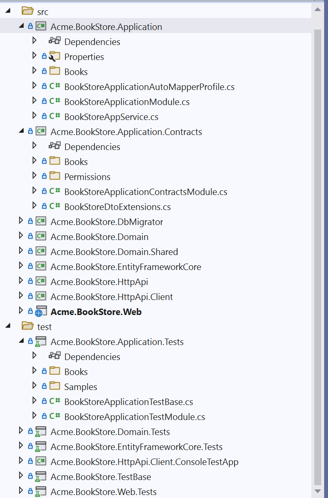

# Consuming REST APIs from a .NET Client Using ABP's Client Proxy System
In this article, we will show how to consume rest api by using static client proxy by creating a new project and converting that from dynamic client proxy to static client proxy. Also, I will glance the differences between static and dynamic generic proxies.

Firstly create a new template via abp cli. 


````shell
abp new Acme.BookStore -t app
````

> If you haven't installed yet, you should install the [ABP CLI](https://docs.abp.io/en/abp/latest/CLI).

At the same folder build the project with the following command on the cli.
````shell
dotnet build /graphbuild
````

It will restore the project and download the NuGet packages.

Now you should run migratior to up your database. To do it, you just should run the DbMigrator project.

Now your project is ready you can run it properly. For more information you can visit [here](https://docs.abp.io/en/abp/latest/Startup-Templates/Application)



From now on, we will add some files to show the case to you.  

### Creating the Appliction Service

Assume that we have an `IBookAppService` interface:

````csharp
using System.Collections.Generic;
using System.Threading.Tasks;
using Volo.Abp.Application.Services;

namespace Acme.BookStore.Books
{
    public interface IBookAppService : IApplicationService
    {
        Task<List<BookDto>> GetListAsync();
    }
}
````

That uses a `BookDto` defined as shown:

```csharp
using System;
using Volo.Abp.Application.Dtos;

namespace Acme.BookStore.Books
{
    public class BookDto : AuditedEntityDto<Guid>
    {
        public string AuthorName { get; set; }

        public string Name { get; set; }

        public DateTime PublishDate { get; set; }

        public float Price { get; set; }
    }
}
```

And implemented as the following:

```csharp
using System.Collections.Generic;
using System.Threading.Tasks;
using Volo.Abp.Application.Services;

namespace Acme.BookStore.Books
{
    public class BookAppService : ApplicationService, IBookAppService
    {
        public Task<List<BookDto>> GetListAsync()
        {
            return Task.FromResult(new List<BookDto>()
            {
                new BookDto(){ Name = "Anna Karenina", AuthorName ="Tolstoy", Price = 50},
                new BookDto(){ Name = "Crime and Punishment", AuthorName ="Dostoevsky", Price = 60},
                new BookDto(){ Name = "Mother", AuthorName ="Gorki", Price = 70}
            });
        }
    }
}
```
It simply returns a list of books. You probably want to get the books from a database, but it doesn't matter for this article. To do it you can visit [here] (https://docs.abp.io/en/abp/latest/Tutorials/Part-1?UI=MVC&DB=EF)

### Creating the Appliction Service Tests
Add a new test class, named BookAppService_Tests in the Application.Tests

```csharp
using System.Threading.Tasks;
using Xunit;

namespace Acme.BookStore.Books
{
    public class BookAppService_Tests : BookStoreApplicationTestBase
    {
        private readonly IBookAppService _bookAppService;

        public BookAppService_Tests()
        {
            _bookAppService = GetRequiredService<IBookAppService>();
        }

        [Fact]
        public async Task Should_Get_List_Of_Books()
        {
            var result = await _bookAppService.GetListAsync();
            Assert.Equal(3, result.Count);
        }
    }
}
```

